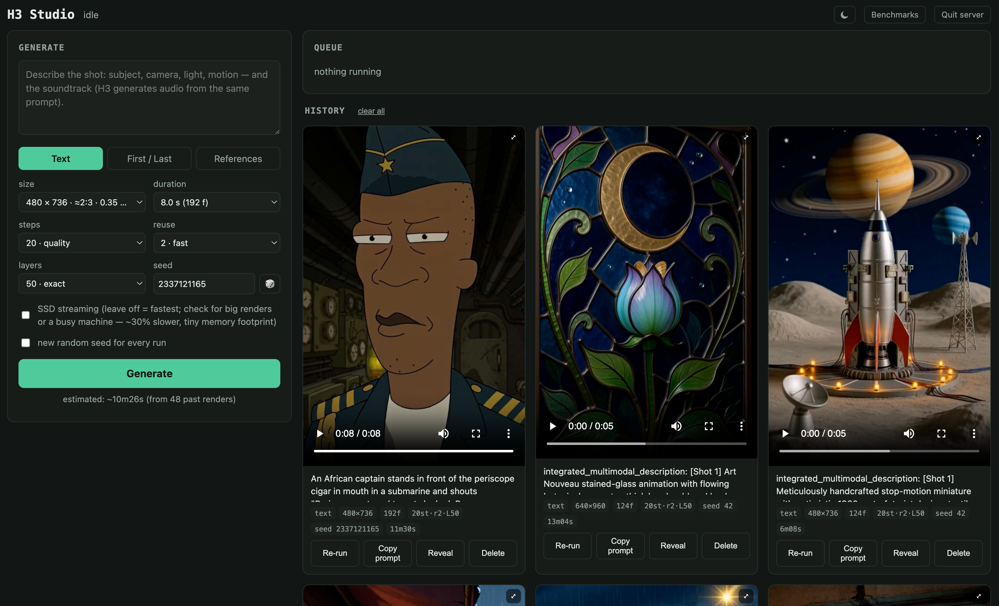

# H3 Studio (Runpod edition)

This fork adds a **Runpod cloud GPU engine** (RTX 4090 + ComfyUI) to H3 Studio, plus Auto mode with brand profiles,
a GPU panel with live cost/balance, and an episode-first history. It runs on **macOS, Linux and Windows (WSL)**;
the original local Apple Silicon engine is optional.

- **New machine?** → [`SETUP.md`](SETUP.md)
- **Operating the Runpod engine** → [`docs/RUNPOD.md`](docs/RUNPOD.md)
- **AI agents (Claude Code, Codex, Grok…)** → [`AGENTS.md`](AGENTS.md)
- Speed & cost → [`docs/BENCHMARKS.md`](docs/BENCHMARKS.md) · Decisions & lessons → [`docs/DECISIONS-AND-LESSONS.md`](docs/DECISIONS-AND-LESSONS.md)

The original README (local h3.c engine on Apple Silicon) follows.

---

# H3 Studio

A zero-dependency local web GUI for [antirez/h3.c](https://github.com/antirez/h3.c) — MiniMax-H3 video generation (video + synchronized audio) on Apple Silicon Macs.



The whole thing is one Python-stdlib server and one HTML file wrapping the `h3` CLI. No frameworks, no pip installs, no cloud — everything runs and stays on your Mac (the server binds to `127.0.0.1` only).

## Features

- **Prompt box with three modes**: text-to-video, first/last-frame conditioning (drag-and-drop images), and reference images (Ref2VA — up to 9, addressed in the prompt as "Picture 1", "Picture 2", …)
- **All generation knobs as controls**: size presets on H3's native grid (multiples of 32), duration on the legal frame ladder, steps / reuse / layers, seed with randomize, SSD-streaming toggle
- **Job queue**: submit several renders; they run one at a time with a live phase/progress bar and cancel
- **History gallery**: every render keeps its video, full prompt, settings, seed, and elapsed time — with Re-run (loads a render's settings back into the form), Copy prompt, Reveal in Finder, and Delete (files go to the Trash, never hard-deleted)
- **Self-learning time estimates**: the form shows a predicted render time computed from your own past renders (`benchmarks.md`, a human-readable log the server appends to — with a notes column that's yours to edit)
- **Content-addressed input images**: dropping the same image twice never creates duplicates
- **Click-to-expand lightbox** for finished videos and input images; light/dark/auto theme

## Requirements

- Apple Silicon Mac (h3.c targets M-series; more unified memory = faster modes available)
- macOS with Xcode Command Line Tools (`xcode-select --install`)
- `ffmpeg` and `ffprobe` on PATH (`brew install ffmpeg`)
- Python 3 (the macOS system one is fine — stdlib only)
- Disk for the weights: the official MiniMax-H3 FL2VA snapshot is ~145 GB (transformer + text encoder + VAEs)

## Setup

```sh
git clone <this repo>
cd h3-studio
./setup.sh          # clones antirez/h3.c into engine/ and builds it
```

Then download the **MiniMax-H3 weights** into `./MiniMax-H3` so it contains the official
`FL2VA/` snapshot layout (`FL2VA/transformer`, `FL2VA/text_encoder`, `FL2VA/video_vae`,
`FL2VA/audio_vae`, `FL2VA/tokenizer`, …). See the [h3.c README](https://github.com/antirez/h3.c)
for weight instructions. The weights are from
[MiniMaxAI/MiniMax-H3](https://huggingface.co/MiniMaxAI/MiniMax-H3) and are governed by the
MiniMax Community License. Optional: add the `Ref2VA/` snapshot for reference-image conditioning
(its text encoder and VAEs are byte-identical to FL2VA's — you only need `Ref2VA/transformer`
plus `Ref2VA/tokenizer`; copy the rest from FL2VA).

Verify, then launch:

```sh
./h3 --info -d MiniMax-H3    # checks weights + GPU
./studio                     # starts the GUI and opens your browser
```

`./studio` is double-click friendly: if the server is already running it just opens the page;
otherwise it starts the server detached (closing the Terminal window doesn't kill it). Stop it
with the **Quit server** button in the page header.

## Memory modes

- **SSD streaming** (default): the DiT streams from disk in a ~2 GB window — works on
  lower-RAM Macs, byte-identical output, somewhat slower.
- **Resident** (uncheck the box): maps the full ~37 GB model into unified memory — the fastest
  mode, recommended for 48 GB+ machines.

## Notes

- Outputs land in `outputs/`, input images in `inputs/`, render history in `gui/history.jsonl`,
  timing log in `benchmarks.md` — all ignored by git.
- The queue is in-memory: pending jobs don't survive a server restart (a running render is a
  live GPU process; the UI always resyncs to truth).
- All engine credit belongs to [antirez/h3.c](https://github.com/antirez/h3.c) and the
  [MiniMax-H3](https://huggingface.co/MiniMaxAI/MiniMax-H3) model authors. This project is
  just the workbench around them.

## License

MIT (see LICENSE) for the Studio code in this repository. The h3.c engine and the model
weights have their own licenses and are not distributed here.
